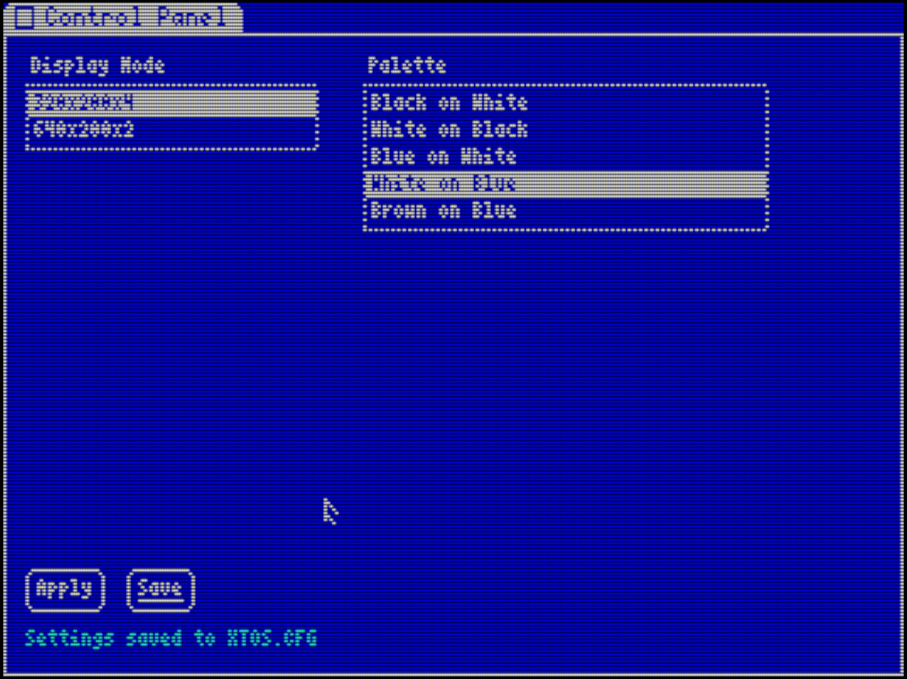
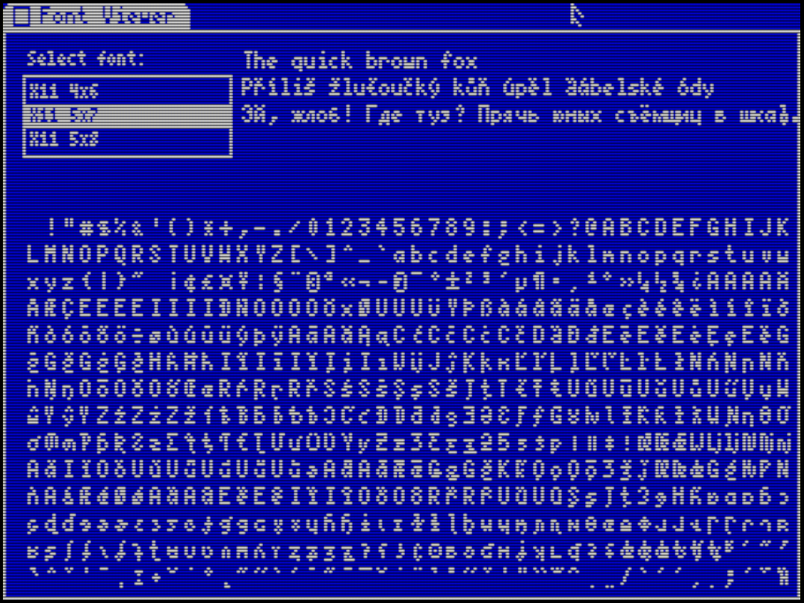
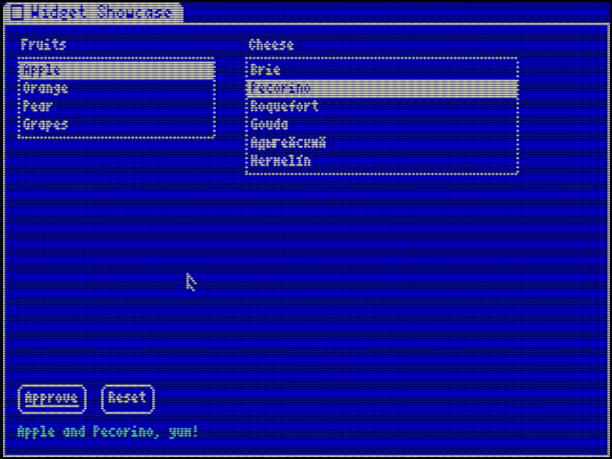

# XTOS — eXtraneous Technology Operating System

XTOS is a retro-inspired, single-task graphical operating system designed for 8086-class hardware, CGA graphics, and C89-level development environments.

It prioritizes simplicity, determinism, and a clean UI toolkit over modern multitasking or windowing complexity.

XTOS is developed with a containerized DOS toolchain and is run under DOSBox
during early development. The runtime stays close to the target DOS/CGA
environment from the start.

---

## Core Goals

- Build a simple graphical operating environment for 8086/CGA systems
- Provide a consistent UI toolkit inspired by early Macintosh and PalmOS systems
- Enable development of small, self-contained applications (editor, paint, games, utilities)
- Maintain a strict, minimal C89-compatible system interface
- Keep the architecture clean enough to eventually replace DOS as the runtime substrate

---

## Design Philosophy

XTOS is based on the following principles:

- **Single-task execution model** (one active application at a time)
- **Event-driven architecture** (apps react to system events via a main loop)
- **Form-based UI system** for structured applications
- **Canvas-based rendering** for graphics and games
- **Document-based views** for text, spreadsheets, terminals, and IDE-like tools
- **Minimal kernel assumptions in user applications**
- **No window-per-control architecture**
- **No object-oriented UI framework**

---

## Development Phases

### Phase 0 — DOS SDK & Runtime Foundation
- Containerized 8086/DOS build toolchain
- DOSBox-based development and test loop
- XTOS C API prototype
- CGA framebuffer modes (320x200 / 640x200)
- Event system + keyboard and mouse input handling
- Font, cursor, and framebuffer rendering system
- Initial UI runtime (Forms + Canvas)
- Reference apps built as DOS executables

### Phase 1 — Application Runtime
- Application loader and execution API
- Runtime packaging conventions
- File and resource access APIs
- System shell or launcher prototype
- Stronger app/runtime boundary

### Phase 2 — UI Framework maturity
- Stable widget system
- Font system expansion
- Cursor states and system feedback
- Resource system v2
- Consistent look-and-feel across applications

### Phase 3 — Display abstraction layer
- Resolution-independent rendering
- Logical coordinate system
- CGA mode switching support
- Device-independent UI layout model

### Phase 4 — Productivity applications
- Text editor (document view system)
- Paint application (canvas system)
- Control panel utilities
- Basic calculator and system tools

### Phase 5 — Kernel independence
- Remove DOS dependency
- Native XTOS bootloader
- Hardware abstraction layer
- Standalone filesystem and drivers

---

## Project Structure

```
xtos/
├── xtos/ # Public XTOS C API headers
├── runtime/ # Core UI runtime and event system
├── kernel/ # DOS-hosted and later native kernel
├── apps/ # Reference and system applications
├── tools/ # Font and resource tools
└── design/ # Architecture and specification documents
```
---

## Target Platforms

- Development: Docker-based ia16 DOS toolchain + DOSBox
- Runtime Phase 0/1: MS-DOS (8086 real mode)
- Future: bare metal 8086-compatible systems

---

## License

GNU LESSER GENERAL PUBLIC LICENSE Version 2.1

---

## Status

Early design phase. No stable API yet.

## Screenshots

### Control Panel



Display mode and palette preferences.

### Font Viewer



UTF-8 font preview and glyph inspection.

### Widget Showcase



Lists, buttons, labels, focus handling, and mouse interaction.